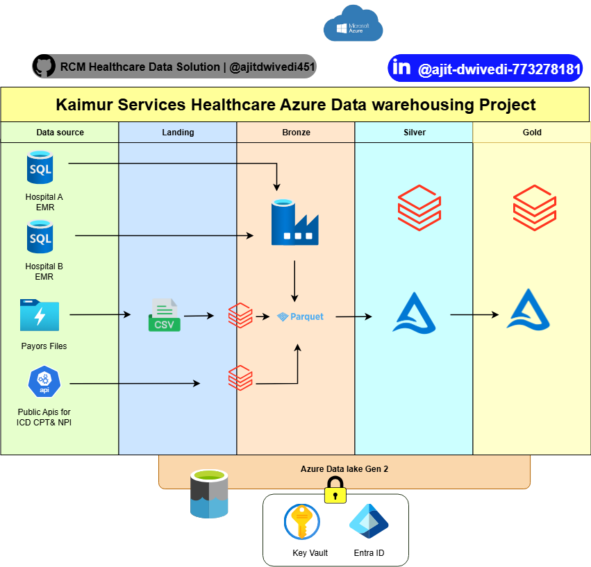

## RCM Healthcare Data Solution (Azure + Databricks)

This project delivers a complete **enterprise-grade end-to-end data engineering solution** on the Azure ecosystem using **Azure Data Factory**, **Azure Data Lake**, **Azure Databricks**, **Unity Catalog**, **Azure Key Vault**, and **CI/CD automation**. The goal is to securely and efficiently process data from ingestion to insight for downstream analytics and reporting.

---

## Project Objectives

- Build a modern **lakehouse architecture**
- Integrate data from **heterogeneous sources**
- Implement robust **data transformation and quality checks**
- Maintain **historical tracking** using SCD Type 2
- Enable **secure access**, **governance**, and **automation**
- Curate **KPI-ready Gold Layer** for downstream analytics

---
## Architecture Diagram

---
## Data Ingestion & Sources

Data was extracted from multiple source systems:

- **Azure SQL Databases** (Hosp A & Hosp B)
- **Azure Data Lake Storage Gen2** (Landing Zone)
- **Manual Uploads** (CSV/Excel files) claims data
- **Public REST APIs**
- 
- 
- 

All sources were ingested using **Azure Data Factory (ADF)** pipelines and landed into the **Bronze Layer** of **ADLS Gen2**, forming the raw zone for further processing.

---
## Data Source Details

This project integrates data from **Electronic Medical Records (EMR)** and **Claims Systems** to build a unified healthcare data lakehouse.

---

###  EMR Data (via Azure SQL Database - Hosp A & B)

| Table Name     | Description                                      |
|----------------|--------------------------------------------------|
| `Patients`     | Patient demographics and identifiers             |
| `Providers`    | Doctor/Practitioner details                      |
| `Department`   | Hospital department/unit metadata                |
| `Transaction`  | Billing and payment-related data                 |
| `Encounter`    | Patient visits, inpatient/outpatient episodes    |

Ingested using **Azure Data Factory** into the **Bronze Layer** (raw zone).

---

### Claims Data (via ADLS Gen2 + Public APIs)

- Claims files are **manually or systemically dumped** by external **insurance companies** into the **landing zone (ADLS Gen2)**
- Ingested using **ADF pipelines**
- Enriched by calling external **public APIs** to retrieve standard healthcare reference codes:
  
  | API Used For       | Code Standard     |
  |--------------------|-------------------|
  | `Insurance Company` | Claim Details     |
  | `NPI Registry API` | Provider NPI Codes|
  | `CPT API`          | Procedure Codes   |
  | `ICD API`          | Diagnosis Codes   |

🔄 This external reference data is fetched using **Databricks notebooks (PySpark)**, integrated, validated, and then written into the **Bronze Layer**.

---

➡️ Both EMR and Claims data were standardized and validated before transformation in the **Silver Layer**.

## Lakehouse Architecture Overview

Ingestion Landing → Bronze Layer → Silver Layer → Gold Layer → Reporting/KPIs

- **Bronze Layer**: Raw ingested data
- **Silver Layer**: Cleaned & standardized data
- **Gold Layer**: Business-ready curated datasets

---
## Data Processing & Transformation (Azure Databricks)

Data was transformed and processed using **Azure Databricks** with **PySpark** notebooks.

**Key transformations included:**

- Data cleansing and schema alignment
- **Common Data Model (CDM)** standardization
- **Data Quality (DQ)** checks and validations
- **SCD Type 2** implementation for historical data tracking
- Write processed data in **Delta Lake format** into:

  - **Silver Layer**: Cleaned, conformed data  
  - **Gold Layer**: Aggregated business-level datasets for reporting and KPIs

---

## Data Governance with Unity Catalog

To enable secure and organized data governance:

- Integrated **Unity Catalog** for centralized **metadata management**
- Applied **fine-grained access controls**:
  - Table-level, column-level, and row-level permissions
- Structured data as:
Catalog > Schema > Table

yaml
Copy
Edit
- Enabled:
- **Data lineage tracking**
- **Audit logging**
- **Multi-tenant access control**

---

## Secret Management with Azure Key Vault

Integrated **Azure Key Vault** to securely manage secrets:

- Stored:
- Database credentials
- Connection strings
- Service principal secrets
-Data bricks access key
- Used secrets securely via:
- ADF **Linked Services** with system-managed identity

✅ This eliminated hardcoded secrets, password and access key of databricks and improved **security posture** and **compliance**.

---

## 🔄 CI/CD Automation (Azure DevOps)

Set up a automated CI/CD pipeline using:

- **Azure DevOps Pipelines** for deployment automation
- **Databricks Repos** with GitHub integration for version control
- **ARM Templates ** for Infrastructure as Code (IaC)
- **Unit & integration testing** for validation
- Promotion across environments: **Dev → QA → Prod**

CI/CD ensures consistency, repeatability, and faster delivery across environments.

---

## Tools & Technologies

| Category               | Tools/Technologies |
|------------------------|--------------------|
| Cloud Platform         | Azure |
| Orchestration          | Azure Data Factory |
| Data Storage           | ADLS Gen2 (Delta Lake) |
| Processing Engine      | Azure Databricks (PySpark) |
| Security & Secrets     | Azure Key Vault |
| Metadata & Governance  | Unity Catalog |
| CI/CD & Automation     | Azure DevOps, Git, ARM |

---

## Outcome

- Fully automated **data pipeline** from multiple sources to curated analytics layer
- **Secure**, **compliant**, and **scalable** architecture
- Delivered **business KPIs** and reporting-ready data to downstream consumers
- Enabled enterprise-level governance with **Unity Catalog**
- Achieved operational efficiency through **CI/CD automation**

---

